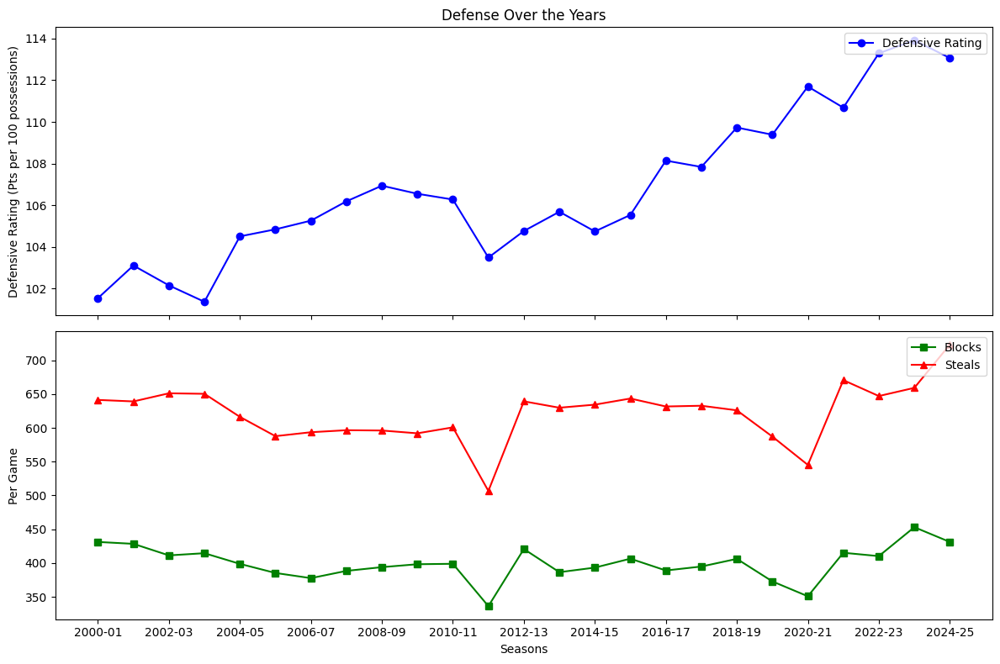

# **🏀 NBA Evolution of Strategy (2000–2025)**

This project analyzes how NBA team strategies have evolved over the past two decades using data from the official [NBA Stats API](https://github.com/swar/nba_api).  
It highlights major shifts in **pace, rebounding, defense, shooting efficiency, assists vs isolation, and the rise of the 3-point shot**.

## **Key Analyses**
We analyze NBA league basic counting data and advanced metric data from the official [NBA Stats API](https://github.com/swar/nba_api) to quantify changes in:</br>
 - **Pace & Possessions** → How tempo has changed across eras.</br>
 - **Rebounding Strategy** → Shift from offensive rebounding to transition defense.</br>
 - **Defense Trends** → Defensive rating, steals, and blocks over time.</br>
 - **Scoring Efficiency** → Effective FG% and True Shooting% trends.</br>
 - **Assists vs Isolation** → Team ball vs isolation baskets.</br>
 - **3PT Evolution** → The growth of 3-point attempts and efficiency.</br>


## **Table of contents**
- [Motivation](#motivation)
- [Data](#data)
- [Methods](#methods)
- [Reproducibility](#reproducibility)
- [Usage](#usage)
- [Code layout](#code-layout)
- [Results](#results)
- [Limitations & ethics](#limitations--ethics)
- [Contact](#contact)

---

## **Motivation**
When we watch older games in the NBA, it's more prominent that how we play today isn't like how we used to play. It's almost as if they were much worse, even though avid fans would argue that today's game is "soft" and required less skill than the league back then. So I wanted to look into this myself and see what part of the game, then, did we take away to get to our style of play today.  

## **Data**
**Source(s):** NBA Stats API (accessed via Python requests or nba_api library).
**Size:**
   - **Rows:** One entry per team per season (≈30 teams × ~30 seasons = ~900 rows).
   - **Columns:** 42 total, including advanced metrics and identifiers such as season, team_id, pace, efg%, ts%, def_rating, orb%, drb%, 3pa, and 3p%.
**Data dictionary:** 
   - SEASON: Year or range representing the NBA season (e.g., 2023–24).
   - TEAM_NAME: Team name.
   - PACE: Possessions per 48 minutes (game tempo).
   - EFG_PCT: Effective field goal percentage (shooting efficiency).
   - TS_PCT: True shooting percentage (overall scoring efficiency).
   - DEF_RATING / OFF_RATING: Points allowed per 100 possessions and Points scored per 100 possessions.
   - OREB_PCT / DREB_PCT: Offensive and defensive rebounding rates.
   - FG3A / FG3_PCT: 3-point attempts and 3-point percentage.
   - FGA / FG_PCT: Field goal attempts and field goal percentage.</br>
   (Full data dictionary in [Data_dictionary.md](Data_dictionary.md))

## **Methods**
**Preprocessing steps:** 
- Removed NaN rows in TEAM_NAMES since older teams that used to exist still show within the database as NaN in more recent data.
- Filled NaN values of counting statistics (e.g. FGA, FGM, BLK, AST, PTS) since it can cause errors for visualization and maintains numerical consistency.
- Left advanced metrics (e.g. FG_PCT, PACE, EFG_PCT, TS_PCT) since filling it with 0 would distort the data and show incorrect data (e.g. A 0% TS_PCT would mean 100% miss throughout the year.)</br>

**Modeling / analysis:** 
- Grouped team data to aggregate league wide averages for each metric.
- Generated time-series plots using matplotlib to visualize any key trends or shifts.</br>

**Tools Used:** Python (pandas, nba_api, matplotlib) for data handling, processing, and visualization.

## **Reproducibility**
```bash
python -m venv venv
source venv/bin/activate
pip install -r requirements.txt
```

## **Usage — step-by-step**
### 1. Download raw data from NBA api (Seasons 2000-25):
```bash
python script/fetch_data.py
```
This will save the following CSVs in data/raw:
- basic_NBA_data.csv
- advanced_NBA_data.csv

### 2. Preprocess:
```bash
python script/preprocess.py --input data/raw --output data/processed
```
This will clean the data by removing NaN values and filling counting statistics with 0.

### 3. Plot Figures:
```bash
python script/plot.py
```
Plots out some graphs to show trends.

## **Code layout**
<pre>
NBA-Evolution-Analysis/
│
├── dashboard/
│   └── NBA_dashboard.pbix
│
├── data/
│   ├── raw/
│   │   ├── basic_NBA_data.csv
│   │   └── advanced_NBA_data.csv
│   └── processed/
│       └── NBA_processed_combined_data.csv
│
├── notebooks/
|   └──NBA_data.ipynb
|
├── outputs/
│   ├── 3-Point Efficiency.png
│   ├── Assists vs Iso.png
│   ├── Defense.png
│   ├── Pace vs Possessions.png
│   ├── Rebounding Strategy (Every 5 Seasons).png
│   └── Scoring Efficiency.png
|
├── script/
│   ├── fetch_data.py
│   ├── preprocess.py
│   └── plot.py
│
├── Analysis.md
├── Data_dictionary.md
├── README.md
└── requirements.txt
</pre>

## **Results**

### Pace vs Possessions


### Rebounding Strategy
.png)

### Defensive Trends


### Scoring Efficiency


### Assisted vs Isolation Baskets


### 3-Point Evolution


For further insights, you can download the Power BI dashboard here:
[Dashboard Link](./dashboard)

## **Limitations & ethics**
- Data only includes NBA team stats from 2000–2025. Some values may be missing or incomplete.
- Merging datasets and filling NaNs with 0 may introduce minor biases.

## **Contact**
Maintainer: Aidan Chow (GitHub: @Ai-C-12, email: chow.aidanl@gmail.com)
